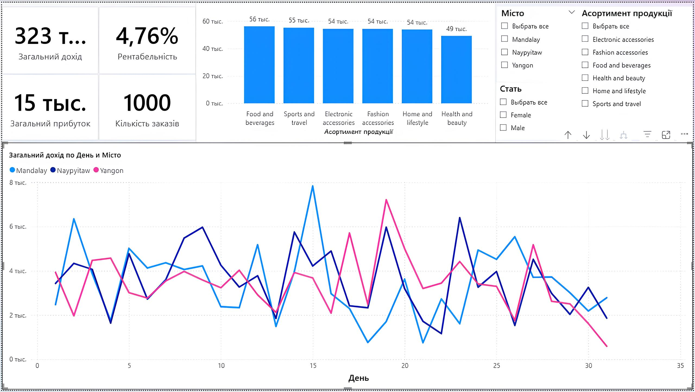

# Supermarket-Sales-Analysis-PowerBI
Інтерактивний дашборд Power BI для аналізу купівельної поведінки клієнтів та ключових показників ефективності (KPI) продажів.

## 📌 Огляд проекту
Цей проект присвячений аналізу роздрібних продажів супермаркету. Мета аналізу — виявити ключові тренди у поведінці покупців, оцінити прибутковість різних категорій товарів та зрозуміти, які чинники найбільше впливають на загальну виручку.

### 🛠 Використані інструменти:
* **Power BI** — для побудови інтерактивних візуалізацій та аналізу.
* **Power Query** — для очищення та трансформації сирих даних (CSV).
* **DAX** — для створення обчислювальних метрик та KPI.

## 📊 Візуалізація дашборду

## 🔍 На які питання відповідає цей аналіз?
* **Ефективність категорій:** Які групи товарів приносять найбільший дохід?
* **Профіль клієнта:** Яка стать та тип членства клієнтів (Member/Normal) є найбільш активними?
* **Географія продажів:** У яких філіях (містах) зафіксовано найвищі показники?
* **Часові тренди:** Як змінюється виручка протягом дня та по місяцях?

## ⚙️ Етапи обробки даних
Перед візуалізацією дані пройшли через процес очищення та трансформації в **Power Query**:
* **Очищення:** Перевірка типів даних (дати, ціни, кількості) та видалення дублікатів.
* **Створення метрик (DAX):** Було створено ключові показники, такі як:
    * **Загальна виручка** (Total Revenue)
    * **Середній чек** (Average Order Value)
    * **Валовий прибуток** (Gross Income)
* **Форматування:** Налаштування категорій товарів та міст для коректного відображення на фільтрах.

## 💡 Основні висновки
* Визначено найбільш прибуткові години пікового навантаження для оптимізації роботи персоналу.
* Виявлено категорії товарів, які мають найвищий рейтинг відгуків, але низькі продажі (потенціал для маркетингу).

---

## 📫 Контакти

Якщо у вас є запитання щодо проекту або пропозиції щодо співпраці, буду радий поспілкуватися:

* **Telegram:** [@dallluk](https://t.me/dallluk)

* **LinkedIn:** [Жемальський Данііл](linkedin.com/in/данііл-жемальський-75aa4938b)

* **Email:** danik.ukraina@gmail.com
